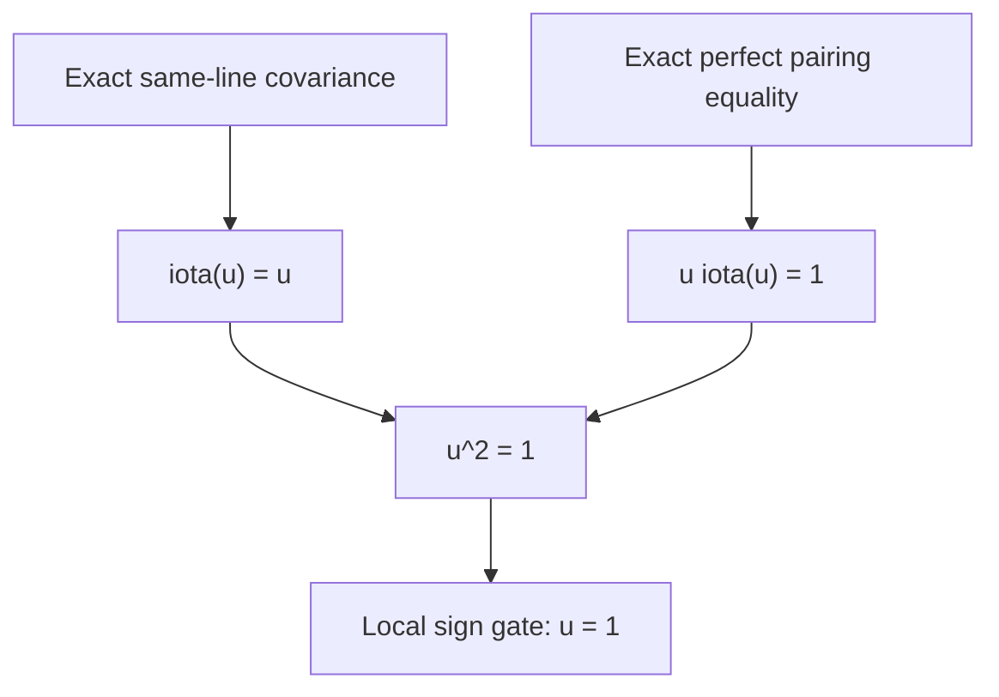

# BSD unit-cohomology exactification firewall

**Date:** 2026-08-12  
**Status:** finite algebraic theorem and hostile obstruction; not BSD and not a
Millennium proof  
**Lean target:** `BSDUnitExactification.lean`  
**Upstream stack:** PR #622,
`agent/bsd-same-line-involutivity-firewall-20260812`, commit
`652afe425683f3662a292b6f59f7fa4e2fdac481`

## 0. Verdict

The scalar exactification argument is a fork, not a chain.

Let `A` be a commutative ring with involution `iota`, let `L = A e` be a
free rank-one line, and suppose the two proposed distinguished bases satisfy

\[
z_{\rm an}=u z_{\rm ar},\qquad u\in A^\times.
\]

The two inputs required to eliminate `u` are logically independent:

1. an **exact matched same-line covariance comparison** must prove
   \(\iota(u)=u\);
2. an **exact perfect common inverse-line pairing comparison** must prove
   \(u\iota(u)=1\).

Only after both inputs exist does the local sign gate imply `u = 1`.  Neither
input is supplied by the currently cited arithmetic sources.  Abstract
duality alone therefore does not exactify the BSD comparison.

## 1. Exact finite algebra

### 1.1 Semilinear involutivity

If

\[
F(xe)=\iota(x)\lambda e,
\]

then

\[
F^2=\mathrm{id}
\quad\Longleftrightarrow\quad
\iota(\lambda)\lambda=1.
\]

This is an exact equivalence, not merely a sufficient condition.

Under a generator change `e' = u e`, the new multiplier is

\[
\lambda'=\iota(u)\lambda u^{-1}.
\]

Since involutivity makes `lambda` a unit,

\[
\lambda'=\lambda
\quad\Longleftrightarrow\quad
\iota(u)=u.
\]

This is the complete content of a matched same-line multiplier comparison.
It does **not** imply `u iota(u) = 1`.

### 1.2 Perfect-pairing cancellation

Suppose a common inverse-line pairing produces a value `q` and the proposed
comparison gives

\[
(u\iota(u))q=q.
\]

If `q` is a unit, cancellation gives

\[
u\iota(u)=1.
\]

In the intended rank-one setting, perfection of the pairing together with
basis hypotheses is what makes `q` a unit.  Merely saying “pairing plus equal
values” is insufficient.

### 1.3 Minimal sign gate

The strongest clean final lemma needed here is:

> **Unit exactification.** Let `A` be a commutative ring.  If
> \(\iota(u)=u\), \(u\iota(u)=1\), and `u + 1` is a unit, then `u = 1`.

Indeed, the first two identities give `u^2 = 1`, hence

\[
(u-1)(u+1)=0.
\]

Multiplication by `(u + 1)^{-1}` proves `u = 1`.  No domain hypothesis is
needed.

For an odd-`p` local or pro-`p` Iwasawa ring, an augmentation-one condition
typically gives `u - 1` in the Jacobson radical.  Since 2 is a unit,

\[
u+1=2+(u-1)
\]

is then a unit.  That application is intentionally not encoded in the Lean
file: it requires the exact ambient completed group ring and its Jacobson
radical theorem to be stated, not waved through.

## 2. Hostile countermodels

### 2.1 Same-line fixedness is not norm one

The smallest exact countermodel is

\[
A=\mathbb Q,\qquad \iota=\mathrm{id},\qquad u=2.
\]

Then `u` is fixed and a matched same-line multiplier is unchanged, while

\[
u\iota(u)=4\ne1.
\]

An augmentation-one nilpotent version is

\[
A=\mathbb F_3[t]/(t^3),\qquad
\iota(t)=-t+t^2,\qquad
u=1+t^2.
\]

Here `iota` is an involution, `iota(u) = u`, and the augmentation is one, but

\[
u\iota(u)=1+2t^2\ne1.
\]

Thus even augmentation-one fixedness cannot replace the pairing branch.

### 2.2 Degenerate pairing equality is not norm one

Over `ZMod 9`, take the unit `u = 4` and the bilinear form

\[
q(x,y)=3xy.
\]

Then

\[
q(u,u)=3\cdot16=3=q(1,1)\pmod 9,
\]

but

\[
u^2=7\ne1\pmod 9.
\]

The Lean model verifies both claims.  It is the finite firewall for the word
“perfect”: equality under a noncancellable pairing proves nothing about the
norm.

### 2.3 Connectedness/sign control is essential

The source-shaped example is

\[
A=\mathbb Z_3[C_2],\qquad g^2=1,qquad
\iota(g)=g^{-1}=g,qquad u=g.
\]

Then `u` is fixed, norm one, augmentation one, and gives equal values under
the perfect multiplication pairing, yet `u != 1`.  The prime-to-`p`
component contains an undetected sign.

The Lean file uses the smaller split finite model

\[
A=\mathbb F_3\times\mathbb F_3,qquad u=(1,-1).
\]

It verifies fixedness under the identity involution, norm one, first-factor
augmentation one, equality under multiplication pairing, `u != 1`, and the
failure of `u + 1` to be a unit.

## 3. Correct proof DAG

Every displayed arrow before the finite sign gate is an arithmetic theorem
still to be proved.  In particular:

- a derived duality isomorphism is not a distinguished same-line covariance
  identity;
- a local cross-pairing is not a global perfect comparison with compatible
  distinguished bases;
- an equality up to a unit is not the exact equality needed for cancellation;
- augmentation one is not sign control in a disconnected ring.

## 4. Source audit and corrections

### 4.1 Macias Castillo--Sano

Primary source: <https://arxiv.org/abs/2603.23978>.

The standing arithmetic conditions in version 1 are **Hypothesis 4.1**, not
Hypothesis 4.4.  The Bertolini--Darmon/Nekovar height comparison is
**Theorem 4.2**, not Theorem 4.5.  Proposition 4.7(v) and Remark 4.8 are the
relevant and correctly numbered duality/parity locations.

Proposition 4.7(v) supplies a derived duality of the form

\[
R\!\operatorname{Hom}(C,\mathbb Z_p[G])[-3]\simeq C^\iota.
\]

Its odd determinant parity leads to a same-line relation.  It does not by
itself supply either fork input above.

### 4.2 Burns--Sano

Primary source: <https://arxiv.org/abs/2003.02153>.

Theorem 4.2 supplies the local cross-pairing in its stated Gorenstein-order
setting.  Even after applying it in both directions under invertible-line
hypotheses, one still needs transpose coherence, distinguished sections,
global transport, perfection at the exact value being cancelled, and equality
of the transported values.  None may be inserted silently.

### 4.3 Sano

Primary source: <https://arxiv.org/abs/2308.08875>.

Proposition 5.15 identifies the exact equation with (5.4.4).  Theorem 5.17
retains an unspecified `Z_p^x` factor.  Theorem 5.19 assumes (5.4.4).  Thus the
source does not manufacture the exact normalization being sought.

### 4.4 Restricted recent successes

Burungale--Skinner--Tian--Wan obtain rank-zero/rank-one `p`-parts using zeta
elements and explicit reciprocity laws: <https://arxiv.org/abs/2409.01350>.
This supports the surviving strategic lesson: an arithmetic rigidifier can
break the invariant-unit symmetry; abstract duality alone cannot.

## 5. Lean boundary and audit contract

`BSDUnitExactification.lean` formalizes:

1. semilinear involutivity if and only if multiplier norm one;
2. the unit change-of-generator multiplier equality if and only if fixedness;
3. cancellable common-value equality implies norm one;
4. fixedness plus norm one plus `IsUnit (u + 1)` implies exact equality;
5. the combined fork join;
6. finite degenerate-pairing and disconnected-sign countermodels.

It deliberately does **not** formalize:

- an elliptic curve, Selmer complex, determinant line, zeta element, or BSD;
- the exact arithmetic covariance branch;
- the exact perfect-pairing comparison branch;
- a completed Iwasawa algebra or its Jacobson radical;
- passage from finite layers to an inverse limit;
- equality of any analytic and arithmetic BSD invariant.

The expected axiom report is limited to accepted Mathlib foundations such as
`propext`, `Quot.sound`, and `Classical.choice` where generated decidability
requires it.  The report is not complete until a clean workflow compiles the
exact preserved blob and prints every theorem's axioms.

## 6. Existing receipt caveat

The predecessor firewall was compiled publicly in `stevemoraco/qs` PR #138,
workflow run `31610398996`, with Lean 4.32.1 and Mathlib commit
`520045ab14e26149ee970e2e617ca04b09bde5d6`.  The source blob matched the PR
head, but the job compiled GitHub's synthetic merge commit rather than a fresh
direct checkout of the head SHA.  Its actions and installer were not pinned by
content hash, and no manifest was committed.  It is corroboration, not the
fresh replay required by the bell condition.

## 7. Surviving target

The finite algebra is now closed.  The shortest honest BSD edge is one of:

1. construct an exact arithmetic same-line covariance for the two
   distinguished bases;
2. construct an exact perfect common inverse-line pairing and prove equality
   of its distinguished values;
3. construct a separate arithmetic rigidifier that fixes the residual unit
   directly.

The first two must meet at the formalized sign gate.  Until one is proved with
all local/global, finite/infinite, and up-to-unit/exact transitions explicit,
this remains a research obstruction, not BSD.
